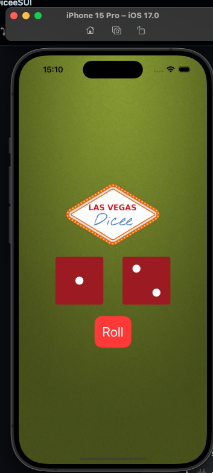

# Dicee SwiftUI Project With MVVM

## Overview
Dicee is a simple dice-rolling app built with SwiftUI. It allows users to simulate the rolling of two six-sided dice.

## Features
- Tap the "Roll" button to randomly roll two dice.
- Each die face is represented by a high-quality image.
- The interface is designed to be simple and intuitive.

## MVVM Architecture
This project follows the Model-View-ViewModel (MVVM) architecture pattern to ensure a clean separation of concerns and improve maintainability.

### Model
Represents the data and business logic of the app. In this case, it's the representation of a dice and its possible states.

### View
Contains the UI components. Views observe the ViewModel and update themselves when the ViewModel's state changes.

### ViewModel
Acts as an intermediary between the Model and the View. It handles the app's logic and updates the View with new data.

## Getting Started
To run this project, clone the repository and open it in Xcode.

bash git clone https://github.com/GeraldCO/DiceeSUI cd DiceeSUI open DiceeSUI.xcodeproj

## Requirements
- iOS 14.0+
- Xcode 12.0+
- Swift 5.3+

## Contributing
Contributions are welcome! Please fork the repository and submit a pull request with your changes.

## License
This project is licensed under the MIT License - see the [LICENSE](LICENSE) file for details.

## Acknowledgments
- Dice images provided by [ExampleResourceProvider](https://example.com/resources).
- SwiftUI tutorials and resources that helped build this app.

---

Generated by Your Gerald, 2024.
